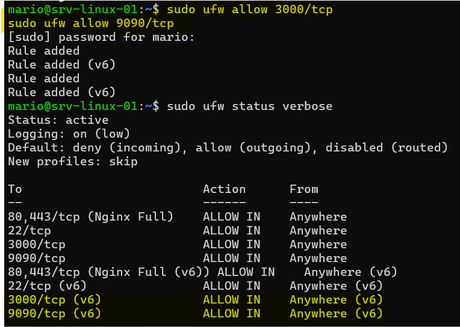
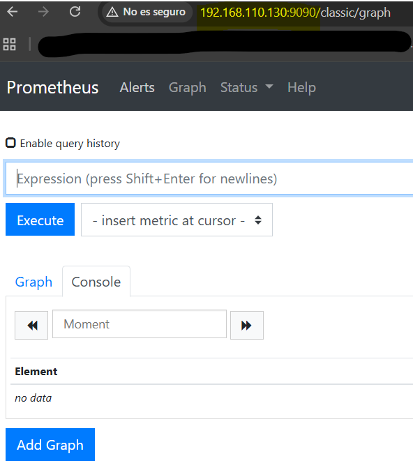
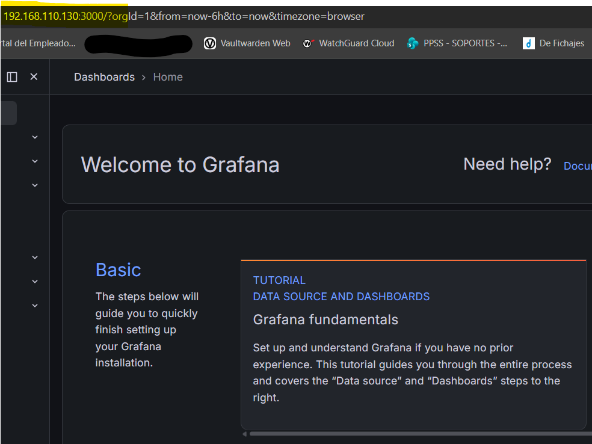
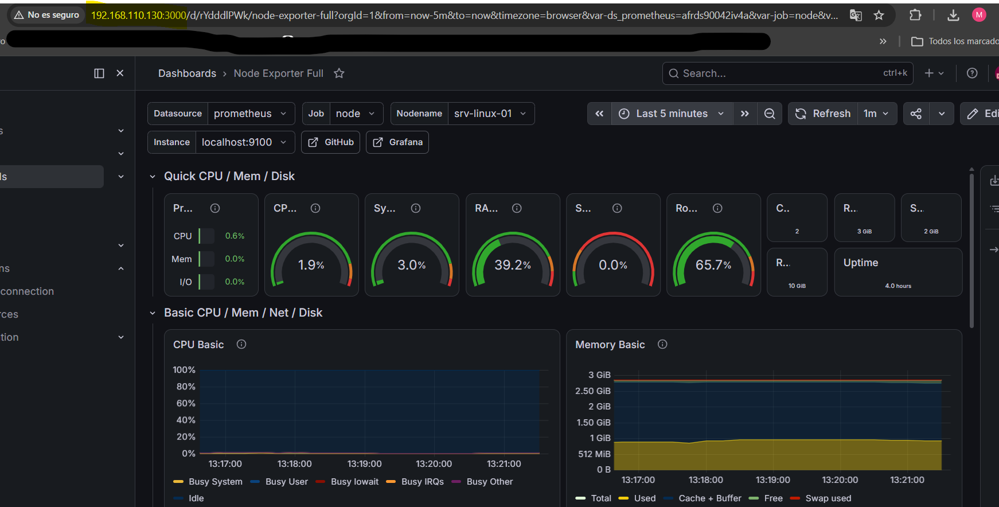

Datos del Proyecto:

Proyecto: Despliegue de Sistema de Monitorización Centralizado

Entorno: Linux Ubuntu Server / Debian (Máquina Virtual en VMware Workstation)

Herramientas: Prometheus, Grafana, Node Exporter, UFW Firewall

Dirección IP del Servidor: 192.168.110.130

1. Resumen Ejecutivo
Este proyecto describe el proceso técnico de instalación, configuración y securización de una solución completa de monitorización para servidores Linux. La arquitectura implementada se basa en el desacoplamiento de funciones: la extracción de métricas del sistema operativo (Node Exporter), el almacenamiento indexado en formato de series temporales (Prometheus) y la visualización analítica avanzada mediante cuadros de mando web (Grafana). El objetivo final es centralizar la telemetría del servidor para permitir un análisis preventivo del rendimiento del hardware.

2. Preparación de la Red y Seguridad (Firewall)
Como paso previo fundamental para garantizar la seguridad del servidor y permitir el acceso web seguro desde equipos externos en la red local, se procedió a configurar el cortafuegos interno del sistema operativo mediante la utilidad UFW (Uncomplicated Firewall).

Se habilitaron de forma explícita los puertos de red estrictamente necesarios para la administración y consulta del entorno:

Puerto 22/TCP: Acceso administrativo remoto seguro a través del protocolo SSH.

Puerto 9090/TCP: Acceso a la interfaz de consultas del motor de datos Prometheus.

Puerto 3000/TCP: Acceso al servidor web de la interfaz de usuario de Grafana.

======================================================================

======================================================================
3. Instalación y Configuración del Motor de Datos (Prometheus)
Se realizó el despliegue del núcleo de almacenamiento indexado Prometheus. El sistema fue configurado de manera nativa mediante su archivo de definición estructurado (prometheus.yml). Tras verificar la integridad del archivo, se procedió a levantar el servicio del sistema y a programarlo en la capa de inicialización del servidor mediante el administrador de servicios de Linux, asegurando su persistencia tras reinicios de la máquina virtual.

Los comandos ejecutados en la consola de administración fueron:

Bash
sudo systemctl start prometheus
sudo systemctl enable prometheus
======================================================================

======================================================================
4. Despliegue del Servidor de Visualización (Grafana)
Una vez asegurado el motor de persistencia de métricas, se instaló el servidor web de Grafana. Esta herramienta es la encargada de procesar las consultas complejas sobre la base de datos y renderizar las colecciones de datos en interfaces de usuario interactivas para el operador.

Se confirmó su correcta inicialización y su estado operacional a través del supervisor del sistema utilizando el siguiente comando:

Bash
sudo systemctl status grafana-server
======================================================================

======================================================================
5. Extracción de Métricas e Integración de Cuadros de Mando
Para la telemetría del hardware del servidor, se implementó el agente oficial "Prometheus Node Exporter". Este subservicio captura con periodicidad de segundos el consumo de memoria RAM, uso de núcleos de CPU, operaciones de lectura/escritura de disco y estadísticas de rendimiento de las interfaces de red.

Desde la consola web de Grafana (accesible en la dirección IP del entorno virtual 192.168.110.130:3000), se vinculó la base de datos local Prometheus como origen predeterminado. Posteriormente, se importó la plantilla estructural oficial de la comunidad número 1860 (Node Exporter Full). Esto generó de forma automatizada un panel analítico integral donde los datos aislados recolectados por el agente se transformaron en variables visuales y gráficas de líneas temporales.

======================================================================

======================================================================
6. Conclusiones
La infraestructura implantada dota al entorno de una visibilidad completa sobre el estado operativo del servidor, permitiendo una administración proactiva ante posibles saturaciones de hardware. La separación estricta en capas (Agente de extracción -> Motor de datos -> Servidor de visualización) proporciona un entorno altamente escalable, preparado para añadir nodos adicionales a la red de monitorización en futuras fases de expansión tecnológica.
